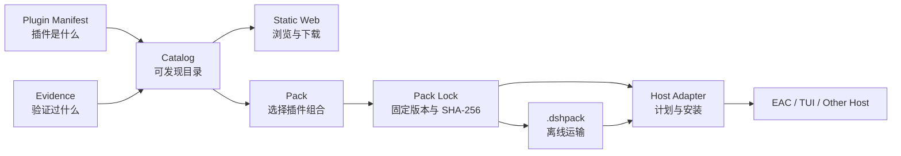

# DSH Mojobox

面向 DSH 生态的插件目录、可复现整合包与兼容证据中心。

Mojobox 把“发现插件、固定组合、验证兼容、交给宿主安装”拆成可审阅的机器可读数据。仓库
提供静态网站和离线 `.dshpack`，但不接管 EAC、TUI 或其他宿主的安装事务。

> Plugin Manifest 描述单个插件；Pack 表达组合意图；Pack Lock 固定版本、来源与摘要；
> Evidence 记录某个精确产物在指定条件下的验证结果。

## 一眼看懂



| Mojobox 负责 | 宿主负责 |
| --- | --- |
| 插件目录、Pack、Lock、Evidence | 检查本机能力和已安装状态 |
| 精确来源、版本和 SHA-256 | 向用户展示变更并取得确认 |
| 静态网站与离线 `.dshpack` | staging、文件锁、启动验证、回滚 |
| 多宿主证据的聚合展示 | profile、用户数据和本地所有权 |

## 当前可用功能

| 能力 | 状态 | 说明 |
| --- | --- | --- |
| 插件目录 | 可用 | 10 条记录；作者 Manifest 与目录代维护记录明确区分 |
| Pack / Pack Lock | 可用 | 2 个维护 Pack；仅接受精确组件版本和 npm 来源 |
| 兼容 Evidence | 可用 | 3 条生产 `Parsed` Evidence；支持多宿主 fixture |
| 静态网站 | 可用 | 搜索、筛选、详情、来源、摘要和下载 |
| 离线 `.dshpack` | 可用 | 构建时下载并校验 tarball，按内容摘要打包 |
| EAC 只读计划与事务安装 | EAC 已实现 | 实现在 EAC 仓库，不属于本仓库公共协议 |
| TUI 生产接入 | 尚未完成 | 当前只有固定 revision 的 admission 映射和 fixture |
| 完整环境迁移 | 不属于 Mojobox | 由 `dsh-distribution` 与对应 Manager 负责 |

当前版本为 `0.1.0-alpha.0`。协议仍可能发生不兼容调整，采用方必须固定 revision。

## 如何使用

### 浏览或下载插件整合包

本地启动目录网站：

```bash
npm ci
npm run dev
```

页面数据来自构建生成的 `site/public/generated/catalog.json`。可下载内容包括插件 Manifest、
Pack、Pack Lock 和 `.dshpack`。

### 维护插件目录

在 `catalog/plugins/` 添加或更新记录，然后运行：

```bash
npm test
```

已有作者 Manifest 时优先保留原始声明；没有作者 Manifest 时必须标记
`x-mojobox-maintenance.source = registry-maintained`。没有真实发布产物的记录标记为
`unpublished`，不得进入 Pack Lock。

### 发布一个 Pack

一个 Pack 由两个同名文件组成：

```text
catalog/packs/<id>.pack.json   # 组合意图：包含什么、哪些是必需组件
catalog/packs/<id>.lock.json   # 发布事实：精确版本、来源、Manifest 和 artifact 摘要
```

构建会重新验证 Lock，并生成离线包：

```bash
npm test
npm run build
```

`.dshpack` 的逻辑结构：

```text
<pack>.dshpack
├── pack.json
├── pack.lock.json
└── objects/sha256/<content-hash>
```

它只运输插件组合，不包含 profile、会话、用户数据或凭据。

### 接入一个宿主

宿主消费生成的 Catalog 和 Pack Lock，并自行实现本地计划与安装。公共数据不会暴露 EAC 的
profile 路径、RPC、snapshot ID 或事务 journal。

最小接入顺序：

1. 读取 `generated/catalog.json`，展示插件、Pack 和 Evidence。
2. 根据 Host 能力过滤不适用的 Pack。
3. 对照 Lock 和本机状态生成只读变更计划。
4. 宿主确有事务能力时，再提供安装、验证与回滚。

详细边界见[架构说明](docs/architecture.md)。

## 开发者快速开始

要求 Node.js 22 或更高版本。

```bash
git clone https://github.com/lanyun077/dsh-mojobox.git
cd dsh-mojobox
npm ci
npm test
npm run dev
```

| 命令 | 用途 | 是否访问网络 |
| --- | --- | --- |
| `npm test` | 校验 Schema、fixtures、摘要和跨文件关系 | 否 |
| `npm run dev` | 生成 Catalog/离线包并启动 Vite | 首次可能访问 npm artifact URL |
| `npm run build` | 生成生产站点到 `dist/` | 首次可能访问 npm artifact URL |
| `npm run preview` | 本地预览已构建站点 | 否 |

下载缓存位于 `.cache/artifacts/`。`site/public/generated/`、`dist/` 和缓存都是生成物，不应
手工编辑或提交。

## 为 coding agent 准备

仓库提供 [AGENTS.md](AGENTS.md)，其中包含：

- 任务到文件的路由；
- 单一事实源与协议边界；
- 必须保持的摘要和引用关系；
- 每类改动的最低验证命令；
- 禁止提交的生成物和敏感内容。

使用 Codex、Claude Code 或其他仓库 Agent 时，让它先读取 `AGENTS.md`，再使用
[Agent 开发指南](docs/agent-guide.md)中的任务模板。例如：

```text
请先读取 AGENTS.md，然后为 <插件名> 添加 Mojobox 目录记录。
只陈述可从给定仓库和 npm 包核验的事实；不要修改 Schema。
完成后运行 npm test，并报告来源、版本、manifestDigest 和 artifactDigest。
```

## 仓库地图

| 路径 | 角色 | 是否事实源 |
| --- | --- | --- |
| `catalog/plugins/` | 插件 Manifest/目录记录 | 是 |
| `catalog/packs/` | Pack 与 Pack Lock | 是 |
| `catalog/evidence/` | 生产 Evidence | 是 |
| `schemas/` | Mojobox wire schema | 是 |
| `fixtures/` | 合法/非法协议样本 | 是 |
| `profiles/` | 宿主能力与 Admission Profile 快照 | 是 |
| `spec-revisions.json` | 上游 revision 与 suite digest | 是 |
| `vendor/dsh-std/` | 固定的上游 Schema 与许可证 | 是 |
| `scripts/validate.mjs` | 结构和跨文件一致性校验 | 是 |
| `scripts/build-site.mjs` | Catalog 与 `.dshpack` 生成 | 是 |
| `site/` | 静态网站源码 | 是 |
| `site/public/generated/` | 构建中间产物 | 否 |
| `dist/`、`.cache/` | 发布产物与下载缓存 | 否 |

## 协议关系

- [`dsh-std`](https://github.com/Yan-Zero/dsh-std)：插件 Manifest、facet、权限和运行时交互。
- [`dsh-distribution`](https://github.com/T-Auto/dsh-distribution)：完整 DSH 环境的身份、组成、数据管理和迁移。
- [`dsh-ecosystem-spec`](https://github.com/T-Auto/dsh-ecosystem-spec)：生态入口；旧 TUI admission 材料作为历史 Evidence 输入保留。
- Mojobox：Catalog、Pack、Pack Lock、Evidence 和 `.dshpack`。

精确 revision 统一记录在 [`spec-revisions.json`](spec-revisions.json)。规范升级必须显式更新
vendored Schema、fixtures、profiles 和相关 Evidence，不能跟随浮动 `main`，也不能只替换
历史 Evidence 中的 revision。

## 文档导航

- [架构与数据流](docs/architecture.md)
- [Agent 开发指南与任务模板](docs/agent-guide.md)
- [贡献流程](CONTRIBUTING.md)
- [仓库级 Agent 规则](AGENTS.md)

## 贡献与验证

提交前至少执行：

```bash
npm test
npm run build
git diff --check
```

使用任务分支和 Pull Request。协议变化必须同时提供合法与非法 fixture，并在 PR 中说明兼容
影响、迁移方式和回退方式。详见 [CONTRIBUTING.md](CONTRIBUTING.md)。

## 非目标

当前不提供账号、评分、通用依赖求解、PKI、插件二进制上传、云端安装、统一宿主事务或完整
环境迁移。校验通过只代表仓库声明自洽，不代表安全认证、永久兼容或任意宿主可安装。

## License

[MIT](LICENSE)
