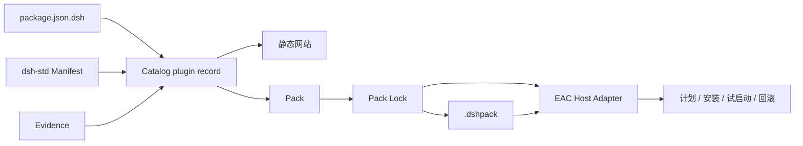

# DSH Mojobox

Mojobox 是面向 DeepSeek Harness 生态的插件目录与可复现整合包基座。当前优先适配
[DeepSeek Harness EAC](https://github.com/lanyun077/Deepseek-Harness-EAC)：Mojobox 提供经过校验的
Catalog、Pack/Lock、Evidence 和离线 `.dshpack`，EAC 负责本机计划、安装、试启动与回滚。

项目仍处于 `0.1.0-alpha.0`。它不是官方认证市场，也不承诺所有插件可在所有宿主运行；采用方
必须固定本仓库 revision。

## 当前基座

目前已推进到第 4 阶段：

| 阶段 | 已实现 | 对团队的意义 |
| --- | --- | --- |
| 1. 上游坐标分离 | 现行 Harness、生态规范、TUI、distribution、EAC 与旧 TUI Evidence 分开固定 | 更新上游不会改写历史证据 |
| 2. 官方包元数据 | 可选读取官方 `package.json.dsh` 字段，并投影为 `x-mojobox-package` | 可逐步接入官方插件声明，不另造插件协议 |
| 3. 通用目录 | 移除插件数和 Pack 数的开发期门槛 | 团队可以持续扩充目录 |
| 4. Pack 分类 | 支持 `function`、`appearance`、`workflow` | 功能包、外观包和工作流包可统一浏览与安装 |

当前生产目录包含 18 条插件记录、4 个 Pack/Lock 和 3 条 `Parsed` Evidence。AIO 已拆为独立的
功能包与外观包。EAC 已具备 Pack 的只读计划和 Level 2 事务安装基线。

尚未完成的内容：官方 Desktop Adapter、新 TUI Profile、Profile/Preset 包、服务端账号与发布
流程。完整环境的身份、布局和迁移属于 `dsh-distribution`，不塞进 Mojobox Pack。

## 对象边界

| 对象 | 回答的问题 | 权威来源/执行方 |
| --- | --- | --- |
| 官方 Package Manifest 投影 | npm 包声明了哪些 DSH、engine、client 字段？ | `deepseek-harness` 的 `package.json.dsh` 类型 |
| `dsh-std` Plugin Manifest | 插件的 facet、权限和运行时契约是什么？ | `dsh-std` |
| Mojobox Pack / Lock | 选择哪些插件，这次精确安装哪些版本和字节？ | Mojobox |
| Evidence | 哪个精确产物在什么宿主和 suite 下验证到哪一级？ | 独立签发方 |
| Host Adapter | 本机要增加、保留或阻止什么，如何回滚？ | EAC 或其他宿主 |
| 完整环境 | 整个 DSH 发行环境如何发现和迁移？ | `dsh-distribution` |

官方包元数据只是对 artifact 中已存在字段的投影。它不替代 `dsh-std` Manifest，也不表示官方
installer 当前已经强制检查 `manifestVersion` 或 `engines.dsh`。

## 数据流



Mojobox 网站只浏览和下载，不读取本机环境，也不直接安装。`dsh-eac://mojobox/...` 深链接只把
目标交给 EAC，最终计划与确认仍在 EAC 内完成。

## 用户使用

本地运行目录网站：

```bash
npm ci
npm run dev
```

页面可以搜索插件、按发布状态和 Evidence 筛选，按 Pack 分类浏览，查看精确版本与摘要，并下载
Manifest、Pack Lock 或离线 `.dshpack`。安装按钮需要已经注册 Mojobox 协议的 EAC。

Pack 分类只影响组织和展示，不改变安装算法：

| 分类 | 用途 | 示例 |
| --- | --- | --- |
| `function` | 提供一组功能增强 | AIO 功能包 |
| `appearance` | 主题、导航、壁纸、挂件等外观 | AIO 外观包 |
| `workflow` | 面向某类工作流程的组合 | 编程、文件处理或桌面操作 |

## 团队开发入口

要求 Node.js 22 或更高版本。先创建任务分支，然后：

```bash
git clone https://github.com/lanyun077/dsh-mojobox.git
cd dsh-mojobox
npm ci
npm test
```

按任务进入对应事实源：

| 要做什么 | 修改入口 | 完成检查 |
| --- | --- | --- |
| 收录插件 | `catalog/plugins/*.json` | `npm test` |
| 新建功能/外观/工作流包 | `catalog/packs/*.pack.json` 与 `*.lock.json` | `npm test && npm run build` |
| 记录真实兼容结果 | `catalog/evidence/*.json` | `npm test` |
| 改协议字段 | `schemas/`、正反 `fixtures/`、validator | `npm test && npm run build` |
| 改目录网站 | `site/` | 根路径和仓库子路径构建、桌面与窄屏检查 |
| 扩展 EAC 安装能力 | EAC 仓库的 `mojobox.ts`、sidecar、bridge 与测试 | EAC 定向测试，按影响提升验收级别 |

详细步骤见[贡献指南](CONTRIBUTING.md)、[架构说明](docs/architecture.md)和
[Agent 开发指南](docs/agent-guide.md)。Coding agent 必须先读 [AGENTS.md](AGENTS.md)。

## 仓库地图

| 路径 | 内容 | 是否事实源 |
| --- | --- | --- |
| `catalog/plugins/` | 插件目录记录 | 是 |
| `catalog/packs/` | Pack 与 Pack Lock | 是 |
| `catalog/evidence/` | 生产 Evidence | 是 |
| `schemas/`、`fixtures/` | Mojobox wire contract 与正反例 | 是 |
| `profiles/` | Host/Profile 快照 | 是 |
| `spec-revisions.json` | 现行上游和历史 Evidence 坐标 | 是 |
| `vendor/dsh-std/` | 固定的 `dsh-std` Schema 与许可证 | 是 |
| `scripts/` | 校验、Catalog 和离线包构建 | 是 |
| `site/` | 静态网站源码 | 是 |
| `site/public/generated/`、`dist/`、`.cache/` | 可重建产物 | 否，不提交 |

## 维护规则

- 插件记录优先使用作者声明；目录代维护必须标记 `registry-maintained`。
- `x-mojobox-package` 只能记录 artifact 的真实 `package.json` 字段，不能补造。
- Pack 与 Lock 必须成对；Lock 只接受精确版本、精确 npm source 和真实 SHA-256。
- Manifest 任意字节变化都必须同步引用它的 Lock 和 Evidence digest。
- 新 revision 生成新 Evidence，不修改旧 Evidence 来制造“最新兼容”。
- 旧 TUI admission 只用于有 revision 的历史 fixture，不是当前公共准入门槛。
- Schema 通过只表示结构和引用自洽，不等于安全或运行兼容。

提交前至少运行：

```bash
npm test
npm run build
git diff --check
```

构建首次可能下载 Lock 指定的 npm tarball；缓存位于 `.cache/artifacts/`。同一输入与 artifact 应
产生字节稳定的 `.dshpack`。

## 上游坐标

- [deepseek-harness](https://github.com/deepseek-ai/deepseek-harness)：官方 Package Manifest 类型与 Desktop 基线。
- [dsh-std](https://github.com/Yan-Zero/dsh-std)：社区插件 Manifest 与运行时契约。
- [dsh-ecosystem-spec](https://github.com/T-Auto/dsh-ecosystem-spec)：生态规范入口。
- [dsh-TUI](https://github.com/ccch1mneyyy/dsh-TUI)：TUI Adapter 实现；当前尚无新 Profile 接入。
- [dsh-distribution](https://github.com/T-Auto/dsh-distribution)：完整环境协议。
- [DeepSeek Harness EAC](https://github.com/lanyun077/Deepseek-Harness-EAC)：当前优先 Host Adapter。

所有精确 commit 记录在 [`spec-revisions.json`](spec-revisions.json)，不跟随浮动 `main`。

## License

[MIT](LICENSE)
