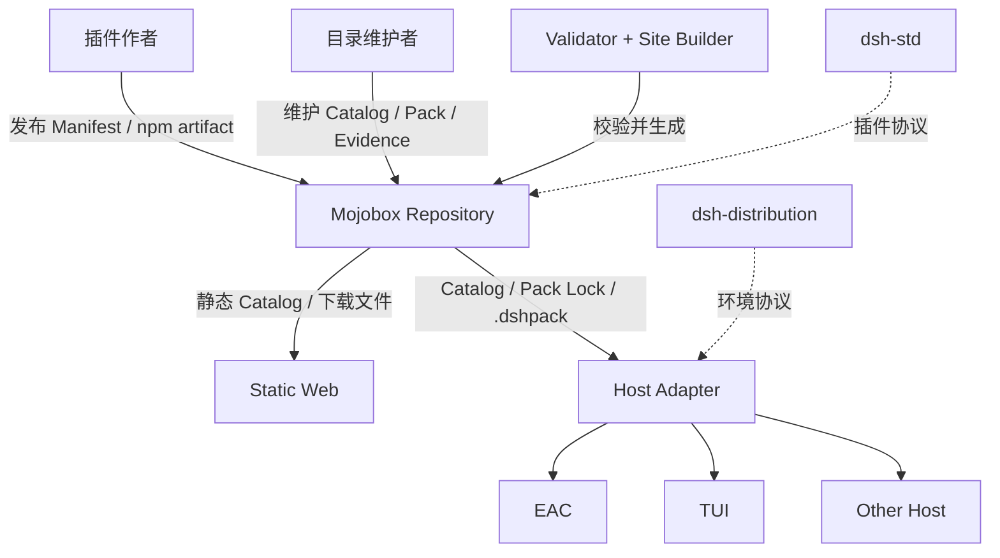
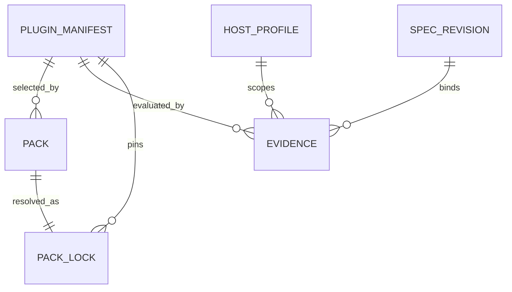
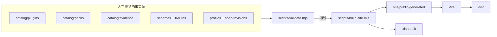
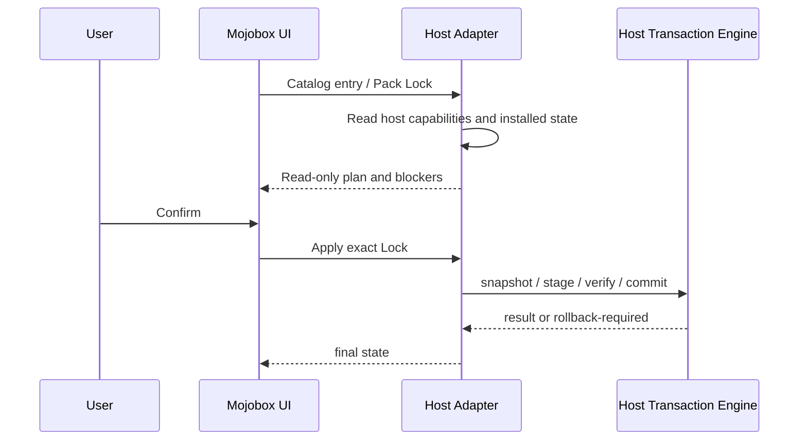

# Mojobox 架构

本文定义 Mojobox 的模块边界、核心对象和数据流。规范性字段以 `schemas/` 与 `fixtures/` 为准。

## 1. 系统上下文

Mojobox 是静态数据与构建项目，不是常驻服务。网站是只读视图；Host Adapter 才接触本机
环境和执行安装。

## 2. 核心对象

| 对象 | 回答的问题 | 关键约束 |
| --- | --- | --- |
| Plugin Manifest | 这个插件是什么？ | 优先采用作者声明；目录代维护必须明确标记 |
| Pack | 希望组合哪些插件？ | 表达必需/可选关系和宿主要求，不写下载事实 |
| Pack Lock | 这次发布究竟安装什么？ | 精确版本、精确 npm 来源、Manifest/artifact SHA-256 |
| Evidence | 在什么条件下验证过什么？ | 绑定 subject、Host、suite、revision、时间和结果 |
| Host Profile | 某宿主提供哪些能力？ | 只描述该宿主，不提升为全生态要求 |
| Spec Revision | 本次声明依据哪版协议？ | 使用完整 commit，不跟随分支或浮动标签 |

## 3. 协议所有权

| 领域 | 权威来源 | Mojobox 行为 |
| --- | --- | --- |
| 插件 facet、权限、entrypoint、运行时协商 | `dsh-std` | 引用和校验，不复制定义 |
| 插件目录、组合、锁定和证据 | Mojobox | 维护 Schema 与数据 |
| 完整环境身份、布局、发现和迁移 | `dsh-distribution` | 不塞入 Pack/Lock |
| TUI 准入规则 | TUI/历史 ecosystem spec 材料 | 作为有 revision 的 Evidence 输入 |
| 本地安装、快照、锁和回滚 | Host Adapter | Mojobox 不规定私有实现 |

发生概念重叠时，遵循权威来源而不是扩展 Mojobox Schema。一个宿主的私有能力只能出现在
Host Profile、Evidence 或 Adapter 层。

## 4. 写入与生成边界

规则：

- 只能修改左侧事实源与构建代码。
- `site/public/generated/`、`dist/`、`.cache/` 随时可以删除重建。
- `npm test` 不访问网络、不执行插件代码。
- `npm run build` 可能下载 Lock 指定的 npm tarball，但必须先验证 SHA-256 才生成离线包。

## 5. 校验链

`scripts/validate.mjs` 执行两层检查：

1. **Schema 校验**：Catalog 与合法 fixture 必须通过；非法 fixture 必须失败。
2. **关系校验**：Pack/Lock 组件集合、Manifest 摘要、artifact 摘要、Evidence、Host Profile、
   suite 与固定 revision 必须互相一致。

Validator 只证明已提交数据结构有效且关系自洽。它不证明 artifact 安全，也不代表真实宿主
已经运行过安装。

## 6. 构建链

`scripts/build-site.mjs` 的处理顺序：

1. 清空并重建 `site/public/generated/`。
2. 复制可下载的 Manifest、Pack 和 Lock。
3. 按 Lock 获取精确 npm artifact。
4. 对 Manifest 原始字节和 artifact 分别验证 SHA-256。
5. 以固定 ZIP 时间和稳定对象顺序生成 `.dshpack`。
6. 生成静态页面读取的 `catalog.json`。
7. Vite 将站点输出到 `dist/`。

同一输入与同一 artifact 应产生相同内容。构建不得写入动态时间、本机绝对路径或用户数据。

## 7. 宿主接入模型

Level 0 宿主只需消费 Catalog；Level 1 增加本地计划；Level 2 才执行事务安装。缺少安装能力时
界面应保持可浏览和可下载，不能把“不支持”伪装成失败或显示不可用写操作。

EAC 当前拥有自己的 Level 2 实现。EAC 私有路径、profile、RPC、snapshot ID、ownership 和
journal 不进入公共 Pack Schema。

## 8. 上游 revision 与 Evidence

`spec-revisions.json` 是上游坐标入口。更新上游协议时：

1. 审阅上游差异；
2. 更新固定 commit 和 vendored Schema/许可证；
3. 更新受影响的 profile 与 fixtures；
4. 重新运行对应 suite；
5. 新签发 Evidence，而不是改写历史 Evidence。

Mojobox Manifest 基线与旧 TUI admission fixture 使用不同 `dsh-std` revision，是当前历史证据
的一部分。除非重新验证，不应为了表面统一而替换 revision 或补造作者字段。

## 9. 与 EAC 同步

EAC 内置插件和 Catalog snapshot 位于 EAC 仓库。本仓库不反向依赖 EAC 私有源码。公共
Catalog 改变后，当前需要人工更新 EAC snapshot 并运行 EAC Mojobox 集成测试；自动
sync/check 命令尚未实现。

## 10. 安全与隐私边界

- 网站不读取用户本机环境，也不直接执行安装。
- Catalog 不保存 token、cookie、凭据或用户路径。
- `.dshpack` 不包含 profile、会话、用户数据或 secrets。
- 外部 artifact 在摘要校验前不能进入发布包。
- Evidence 是范围有限的验证记录，不是安全认证或永久兼容承诺。
